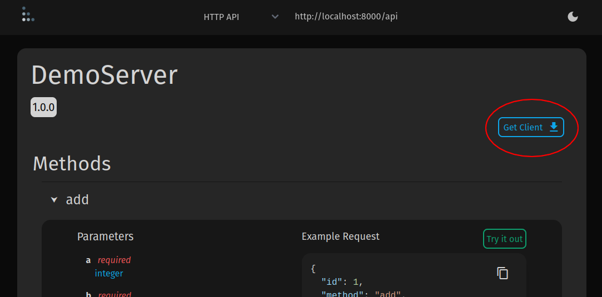

# Client Generator

Since the [OpenRPC](https://spec.open-rpc.org/) document is auto generated, clients for
an RPC API can be auto-generated. To generate TypeScript, or Python clients for an API
you can use the
[OpenRPC Client Generator](https://gitlab.com/mburkard/openrpc-client-generator).

Additionally, the client generator is built into
[Tabella](https://gitlab.com/mburkard/tabella) and can be used from the interactive docs
WebUI.

