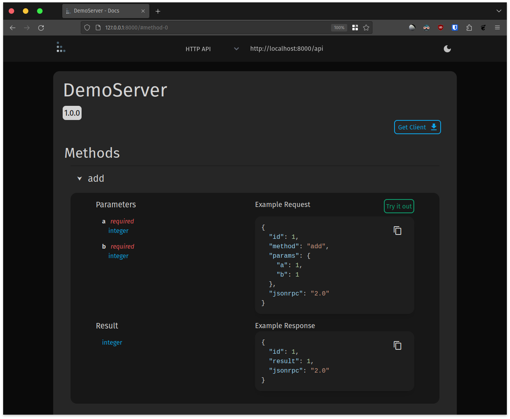

# Interactive Documentation

[Tabella](https://gitlab.com/mburkard/tabella) provides generated interactive
documentation for your RPC API.

A live demo is available [here](https://tabella.burkard.cloud/).

## Using Tabella

First, install Tabella and uvicorn.

Pip
```shell
pip install tabella uvicorn
````
Poetry
```shell
poetry add tabella uvicorn
```

Run:

```python
import uvicorn
from openrpc import RPCServer
import tabella

rpc = RPCServer(title="DemoServer", version="1.0.0")


@rpc.method()
async def add(a: int, b: int) -> int:
    return a + b


app = tabella.get_app(rpc)

if __name__ == "__main__":
    uvicorn.run(app, host="127.0.0.1", port=8000)
```
Then open http://127.0.0.1:8000/ to see the auto generated documentation.



# RPC Discover

The [OpenRPC spec](https://spec.open-rpc.org/) defines a method called `rpc.discover`,
which returns an [OpenRPC Document](https://spec.open-rpc.org/#openrpc-document)
describing the API. This JSON document lists each method in the API, what params they
expect and what results they produce.

## Using Discover

The `rpc.discover` method is automatically generated for your API. This code:

```python
from openrpc import RPCServer

rpc = RPCServer(title="RPCServer", version="1.0.0", debug=True)


@rpc.method()
def add(a: int, b: int) -> int:
    return a + b


req = '{"id": 1, "method": "rpc.discover", "jsonrpc": "2.0"}'
print(rpc.process_request(req))
```

Will print the following OpenRPC document.

```json
{
  "id": 1,
  "result": {
    "openrpc": "1.2.6",
    "info": {
      "title": "RPCServer",
      "version": "1.0.0"
    },
    "methods": [
      {
        "name": "add",
        "params": [
          {
            "name": "a",
            "schema": {
              "type": "integer"
            },
            "required": true
          },
          {
            "name": "b",
            "schema": {
              "type": "integer"
            },
            "required": true
          }
        ],
        "result": {
          "name": "result",
          "schema": {
            "type": "integer"
          },
          "required": true
        }
      }
    ],
    "components": {
      "schemas": {}
    }
  },
  "jsonrpc": "2.0"
}
```
